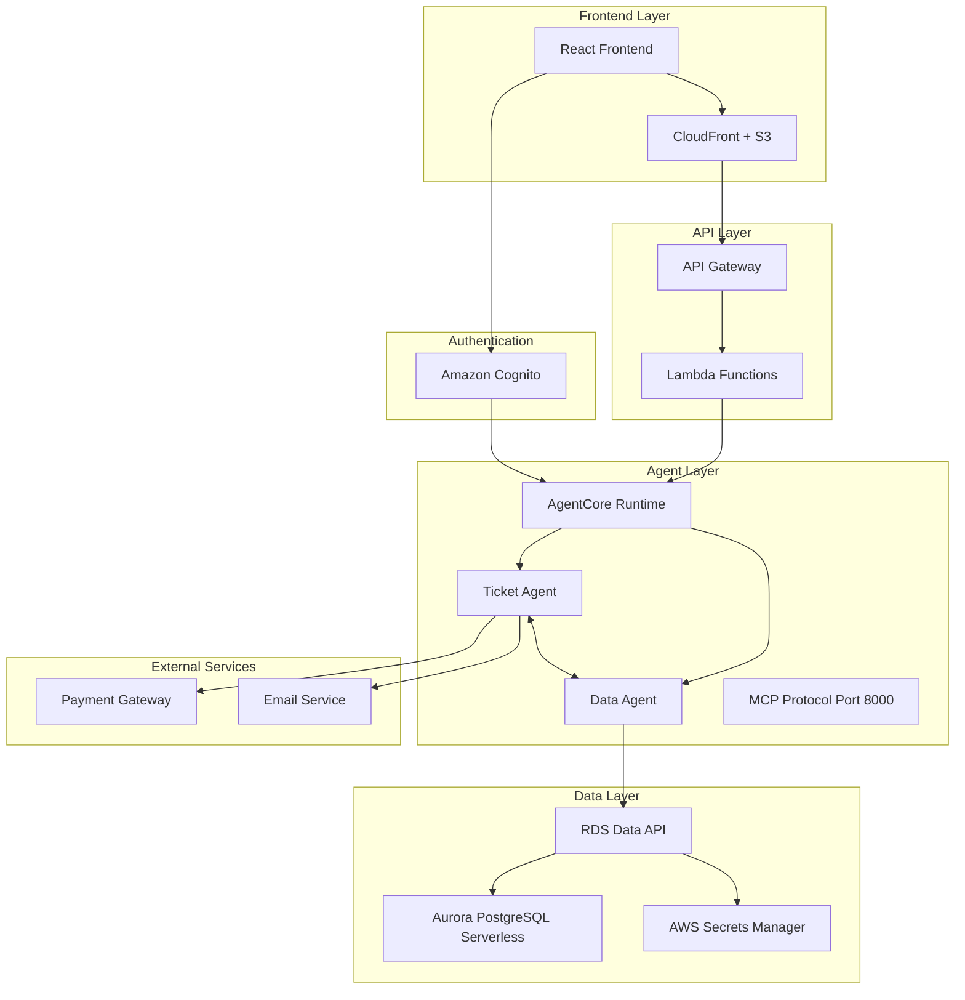
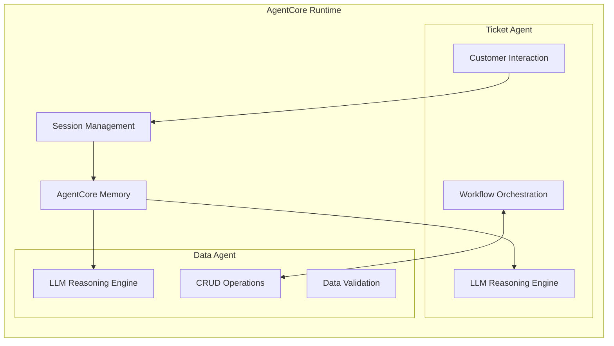

# Design Document: Ticket Auto-Processing System

## Overview

The Ticket Auto-Processing System is a sophisticated multi-agent platform deployed on AWS that automates the complete ticket upgrade workflow. The system leverages Amazon AgentCore Runtime for intelligent agent deployment, combining AI reasoning capabilities with robust cloud infrastructure to handle ticket validation, upgrade processing, payment transactions, and customer notifications.

The architecture follows a microservices approach with clear separation between frontend (React/Node.js), backend (Python/Lambda), and agent services (AgentCore Runtime). Two specialized AI agents work in concert: the Ticket Agent handles customer interactions and workflow orchestration, while the Data Agent manages all data operations and validations.

## Architecture

### High-Level System Architecture

```
┌─────────────────────────────────────────────────────────────────────────────────┐
│                              FRONTEND LAYER                                     │
│  ┌─────────────────┐    ┌──────────────────────────────────────────────────┐   │
│  │  React Frontend │────│            CloudFront + S3                      │   │
│  │                 │    │         (Static Asset Delivery)                 │   │
│  └─────────────────┘    └──────────────────────────────────────────────────┘   │
└─────────────────────────────────────────────────────────────────────────────────┘
                                           │
                                           ▼
┌─────────────────────────────────────────────────────────────────────────────────┐
│                                API LAYER                                        │
│  ┌─────────────────┐    ┌──────────────────────────────────────────────────┐   │
│  │   API Gateway   │────│              Lambda Functions                    │   │
│  │  (REST/WebSocket│    │           (Python Runtime)                      │   │
│  │   Rate Limiting)│    │        ┌─────────────────────────────────────┐   │   │
│  └─────────────────┘    │        │  • Authentication Handler          │   │   │
│                         │        │  • Agent Orchestrator              │   │   │
│                         │        │  • Response Formatter              │   │   │
│                         │        │  • Monitoring Handler              │   │   │
│                         │        └─────────────────────────────────────┘   │   │
│                         └──────────────────────────────────────────────────┘   │
└─────────────────────────────────────────────────────────────────────────────────┘
                                           │
                                           ▼
┌─────────────────────────────────────────────────────────────────────────────────┐
│                              AGENT LAYER                                        │
│                    ┌──────────────────────────────────────┐                    │
│                    │         AgentCore Runtime            │                    │
│                    │      (Session & Memory Management)   │                    │
│                    └──────────────────────────────────────┘                    │
│                                           │                                     │
│                    ┌──────────────────────┼──────────────────────┐             │
│                    │                      │                      │             │
│                    ▼                      ▼                      ▼             │
│  ┌─────────────────────────┐    ┌─────────────────────────┐    ┌─────────────┐ │
│  │     Ticket Agent        │◄──►│      Data Agent         │    │ MCP Server  │ │
│  │                         │    │                         │    │ Port 8000   │ │
│  │ • LLM Reasoning Engine  │    │ • LLM Reasoning Engine  │    │             │ │
│  │ • Workflow Orchestration│    │ • Data Validation       │    │ fastMCP     │ │
│  │ • Customer Interaction  │    │ • CRUD Operations       │    │ Protocol    │ │
│  │ • Business Logic        │    │ • Cache Management      │    │             │ │
│  └─────────────────────────┘    └─────────────────────────┘    └─────────────┘ │
└─────────────────────────────────────────────────────────────────────────────────┘
                    │                      │
                    ▼                      ▼
┌─────────────────────────────────────────────────────────────────────────────────┐
│                              DATA LAYER                                         │
│  ┌─────────────────┐    ┌──────────────────────────────────────────────────┐   │
│  │  RDS Data API   │────│         Aurora PostgreSQL Serverless            │   │
│  │                 │    │                                                  │   │
│  │ • HTTP Interface│    │  ┌─────────────────────────────────────────────┐ │   │
│  │ • Auto Scaling  │    │  │ Tables: customers, tickets, upgrade_orders  │ │   │
│  │ • Connection    │    │  │ • ACID Transactions                         │ │   │
│  │   Management    │    │  │ • Automatic Backups                        │ │   │
│  └─────────────────┘    │  │ • Multi-AZ Deployment                       │ │   │
│                         │  └─────────────────────────────────────────────┘ │   │
│                         └──────────────────────────────────────────────────┘   │
│                                           │                                     │
│  ┌─────────────────┐                     │                                     │
│  │ AWS Secrets     │─────────────────────┘                                     │
│  │ Manager         │                                                           │
│  │ (DB Credentials)│                                                           │
│  └─────────────────┘                                                           │
└─────────────────────────────────────────────────────────────────────────────────┘

┌─────────────────────────────────────────────────────────────────────────────────┐
│                         EXTERNAL INTEGRATIONS                                   │
│                                                                                 │
│  ┌─────────────────┐    ┌─────────────────┐    ┌─────────────────────────────┐ │
│  │ Amazon Cognito  │    │ Payment Gateway │    │      Email Service          │ │
│  │                 │    │                 │    │                             │ │
│  │ • User Auth     │    │ • Dummy Gateway │    │ • SES/SendGrid              │ │
│  │ • JWT Tokens    │    │ • Test Mode     │    │ • Confirmation Emails       │ │
│  │ • User Pools    │    │ • No Real Txns  │    │ • Notification Templates    │ │
│  └─────────────────┘    └─────────────────┘    └─────────────────────────────┘ │
└─────────────────────────────────────────────────────────────────────────────────┘

Data Flow:
1. User → CloudFront → API Gateway → Lambda → AgentCore Runtime
2. Ticket Agent ↔ Data Agent (via MCP Protocol)
3. Data Agent → RDS Data API → Aurora PostgreSQL
4. Ticket Agent → External Services (Payment, Email)
5. All components ← Cognito (Authentication)
```



### Agent Communication Architecture



## Components and Interfaces

### 1. Frontend Components

**React Application Structure:**
- **Authentication Module**: Cognito integration for user login/registration
- **Ticket Selection Interface**: Interactive upgrade tier selection with calendar view
- **Payment Processing UI**: Secure payment form with real-time validation
- **Confirmation Dashboard**: Order status and confirmation display
- **Error Handling Components**: User-friendly error messages and retry mechanisms

**Key Interfaces:**
```typescript
interface UpgradeRequest {
  ticketId: string;
  customerId: string;
  selectedTier: 'standard' | 'non-stop' | 'double-fun';
  selectedDate: Date;
}

interface PaymentRequest {
  upgradeId: string;
  paymentMethod: PaymentMethod;
  amount: number;
  currency: string;
}
```

### 2. Backend API Components

**Lambda Function Architecture:**
- **Authentication Handler**: Validates Cognito tokens and manages session state
- **Agent Orchestrator**: Routes requests to appropriate AgentCore agents
- **Response Formatter**: Standardizes API responses and error handling
- **Monitoring Handler**: Collects metrics and logs for observability

**API Gateway Configuration:**
- RESTful endpoints for ticket operations
- WebSocket support for real-time updates
- CORS configuration for frontend integration
- Rate limiting and throttling policies

### 3. AgentCore Runtime Components

**Ticket Agent (Primary Orchestrator):**
- **Customer Interaction Engine**: Natural language processing for customer queries
- **Workflow State Machine**: Manages multi-step upgrade process
- **Business Logic Processor**: Applies upgrade rules and pricing calculations
- **Integration Manager**: Coordinates with external payment and notification services

**Data Agent (Data Management Specialist):**
- **Validation Engine**: Ensures data integrity and business rule compliance
- **Database Interface**: Manages all Aurora PostgreSQL interactions via Data API
- **Cache Manager**: Optimizes data access patterns and reduces database load
- **Audit Logger**: Tracks all data modifications for compliance and debugging

**MCP Integration:**
Both agents implement fastMCP protocol for efficient communication:
```python
from mcp.server import FastMCP
from bedrock_agentcore.runtime import BedrockAgentCoreApp

app = BedrockAgentCoreApp()
mcp_server = FastMCP("TicketAgent")

@app.entrypoint
@mcp_server.tool(description="Process ticket upgrade request")
async def process_upgrade(request: UpgradeRequest) -> UpgradeResponse:
    # Agent implementation with LLM reasoning
    pass
```

### 4. Database Components

**Aurora PostgreSQL Schema:**
```sql
-- Core entities
CREATE TABLE customers (
    id UUID PRIMARY KEY,
    email VARCHAR(255) UNIQUE NOT NULL,
    cognito_user_id VARCHAR(255) UNIQUE,
    created_at TIMESTAMP DEFAULT NOW()
);

CREATE TABLE tickets (
    id UUID PRIMARY KEY,
    customer_id UUID REFERENCES customers(id),
    ticket_type VARCHAR(50) NOT NULL,
    status VARCHAR(50) DEFAULT 'active',
    purchase_date TIMESTAMP DEFAULT NOW()
);

CREATE TABLE upgrade_orders (
    id UUID PRIMARY KEY,
    ticket_id UUID REFERENCES tickets(id),
    upgrade_tier VARCHAR(50) NOT NULL,
    amount DECIMAL(10,2) NOT NULL,
    status VARCHAR(50) DEFAULT 'pending',
    created_at TIMESTAMP DEFAULT NOW()
);
```

**Data API Integration:**
- Serverless database access without connection pooling
- Automatic credential management via AWS Secrets Manager
- Transaction support for complex operations
- Built-in retry logic for resilience

## Data Models

### Core Business Entities

**Customer Model:**
```python
from pydantic import BaseModel, EmailStr
from uuid import UUID
from datetime import datetime

class Customer(BaseModel):
    id: UUID
    email: EmailStr
    cognito_user_id: str
    first_name: str
    last_name: str
    created_at: datetime
    updated_at: datetime
```

**Ticket Model:**
```python
class Ticket(BaseModel):
    id: UUID
    customer_id: UUID
    ticket_type: str
    original_price: Decimal
    purchase_date: datetime
    status: TicketStatus
    metadata: Dict[str, Any]
```

**Upgrade Order Model:**
```python
class UpgradeOrder(BaseModel):
    id: UUID
    ticket_id: UUID
    upgrade_tier: UpgradeTier
    original_tier: str
    price_difference: Decimal
    total_amount: Decimal
    status: OrderStatus
    payment_intent_id: Optional[str]
    confirmation_code: str
    created_at: datetime
    completed_at: Optional[datetime]
```

### Agent Communication Models

**Agent Request/Response:**
```python
class AgentRequest(BaseModel):
    session_id: str
    user_id: str
    message: str
    context: Dict[str, Any]
    timestamp: datetime

class AgentResponse(BaseModel):
    session_id: str
    response_text: str
    actions: List[AgentAction]
    next_steps: List[str]
    confidence_score: float
```

## Error Handling

### Error Classification and Response Strategy

**1. User Input Errors (4xx)**
- Invalid ticket IDs or customer information
- Malformed payment data
- Authentication failures
- Response: Clear error messages with corrective guidance

**2. Business Logic Errors (422)**
- Ticket not eligible for upgrade
- Selected upgrade tier unavailable
- Payment amount mismatches
- Response: Detailed explanation with alternative options

**3. External Service Errors (502/503)**
- Payment gateway timeouts (dummy gateway for development/testing)
- Email service failures
- Database connectivity issues
- Response: Retry mechanisms with exponential backoff

**4. Agent Reasoning Errors (500)**
- LLM processing failures
- Agent communication timeouts
- Memory access errors
- Response: Fallback to rule-based processing with human escalation

### Resilience Patterns

**Circuit Breaker Implementation:**
```python
from circuitbreaker import circuit

@circuit(failure_threshold=5, recovery_timeout=30)
async def call_payment_gateway(payment_data: PaymentRequest):
    # Payment processing with automatic circuit breaking
    pass
```

**Retry Strategy:**
- Exponential backoff for transient failures
- Maximum retry limits to prevent infinite loops
- Dead letter queues for failed operations
- Comprehensive logging for debugging

## Testing Strategy

### Dual Testing Approach

The system employs both unit testing and property-based testing to ensure comprehensive coverage and correctness validation.

**Unit Testing Focus:**
- Specific business scenarios and edge cases
- Integration points between components
- Error condition handling
- Authentication and authorization flows

**Property-Based Testing Focus:**
- Universal properties that must hold across all inputs
- Data integrity and consistency validation
- Agent reasoning correctness
- End-to-end workflow properties

### Testing Framework Configuration

**Property-Based Testing Setup:**
- **Framework**: Hypothesis for Python components
- **Minimum Iterations**: 100 per property test
- **Test Tagging**: Each property test references design document properties
- **Tag Format**: `Feature: ticket-auto-process, Property {number}: {property_text}`

**Agent Testing Strategy:**
- **Local Development**: Agents tested with real Aurora database connections
- **LLM Reasoning Validation**: Verify intelligent decision-making capabilities
- **MCP Protocol Testing**: Ensure proper fastMCP communication
- **Integration Testing**: Multi-agent workflow validation
- **Customer Simulation**: Test cases simulating various customer interaction patterns

### Test Environment Configuration

**Development Environment:**
- Local AgentCore Runtime with development credentials
- Aurora PostgreSQL with test data generation
- **Dummy payment gateway** for safe testing (no real transactions)
- Comprehensive logging and debugging tools

**Production Testing:**
- Staging environment with production-like configuration
- Real AWS services with IAM role-based authentication
- End-to-end workflow validation
- Performance and load testing

## Correctness Properties

*A property is a characteristic or behavior that should hold true across all valid executions of a system—essentially, a formal statement about what the system should do. Properties serve as the bridge between human-readable specifications and machine-verifiable correctness guarantees.*

### Agent Reasoning and Communication Properties

**Property 1: Ticket Agent LLM Reasoning**
*For any* customer request related to ticket upgrades, the Ticket Agent should use LLM reasoning to produce appropriate responses and workflow guidance that address the customer's needs
**Validates: Requirements 1.3**

**Property 2: Data Agent LLM Reasoning**
*For any* data operation request, the Data Agent should use LLM reasoning to perform correct validation and data manipulation operations
**Validates: Requirements 1.4**

**Property 3: Session Management**
*For any* new conversation initiation, the AgentCore Runtime should generate a unique session identifier and properly store the conversation history in AgentCore Memory
**Validates: Requirements 1.5**

**Property 4: Memory Persistence**
*For any* conversation session, the AgentCore Runtime should maintain both short-term and long-term memory consistently across all conversation turns
**Validates: Requirements 1.6**

### Ticket Processing Properties

**Property 5: Ticket Validation**
*For any* upgrade request, the Ticket Agent should validate ticket eligibility and provide appropriate validation results
**Validates: Requirements 2.1**

**Property 6: Upgrade Calculation**
*For any* valid ticket, the Upgrade Engine should calculate available upgrade options with correct pricing information
**Validates: Requirements 2.2**

**Property 7: Upgrade Tier Consistency**
*For any* upgrade options presentation, the system should always present exactly three upgrade tiers: Standard, Non-stop, and Double Fun
**Validates: Requirements 2.3**

**Property 8: Calendar Integration**
*For any* upgrade options presentation, the system should include availability calendar data with corresponding pricing information
**Validates: Requirements 2.4**

**Property 9: Selection Processing**
*For any* valid upgrade tier selection, the system should process the selection and proceed to payment workflow
**Validates: Requirements 2.5**

**Property 10: Validation Error Handling**
*For any* invalid ticket, the Ticket Agent should provide clear error messages with appropriate guidance for resolution
**Validates: Requirements 2.6**

### Payment Processing Properties

**Property 11: Payment Transaction Processing**
*For any* payment initiation, the Payment Gateway should securely process the transaction and return appropriate status information
**Validates: Requirements 3.1**

**Property 12: Payment Success Notification**
*For any* successful payment, the system should automatically generate and send confirmation emails to the customer
**Validates: Requirements 3.2**

**Property 13: Payment Failure Handling**
*For any* failed payment, the Payment Gateway should implement retry mechanisms and provide appropriate error notifications
**Validates: Requirements 3.3**

**Property 14: Payment Data Persistence**
*For any* completed payment, the Data Agent should update customer and order records in the Aurora Database with accurate information
**Validates: Requirements 3.5**

### Data Management Properties

**Property 15: Data Integrity Validation**
*For any* customer information update, the Data Agent should validate data integrity before committing changes to the database
**Validates: Requirements 4.4**

### Authentication and Security Properties

**Property 16: Authentication Integration**
*For any* user authentication, the Cognito Service should properly integrate with AgentCore Runtime authentication mechanisms
**Validates: Requirements 5.2**

**Property 17: UI Authentication Integration**
*For any* system access attempt, the Frontend UI should properly integrate with Cognito for login authentication
**Validates: Requirements 7.3**

### API and Communication Properties

**Property 18: API Request Routing**
*For any* API request received, the Lambda Functions should properly invoke the corresponding AgentCore Runtime services
**Validates: Requirements 6.2**

**Property 19: API Error Handling**
*For any* API error condition, the Backend API should implement proper error handling and return appropriately formatted responses
**Validates: Requirements 6.3**

### User Interface Properties

**Property 20: UI Interface Provision**
*For any* user interaction, the Frontend UI should provide appropriate user interfaces for ticket upgrade selection and payment processing
**Validates: Requirements 7.2**

**Property 21: Real-time Feedback**
*For any* upgrade process step, the Frontend UI should provide real-time feedback to keep users informed of progress and status
**Validates: Requirements 7.5**