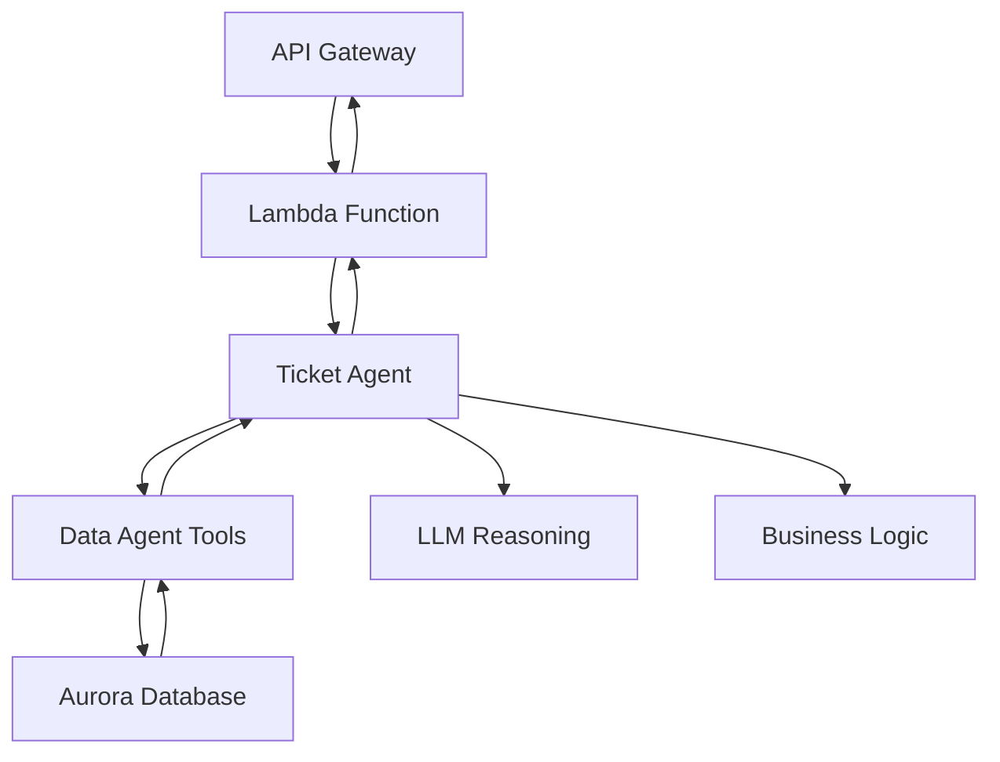

# Architecture Flow Correction Summary

**Date:** January 3, 2026  
**Task:** Correct Lambda → Agent Communication Flow  
**Status:** ✅ COMPLETED SUCCESSFULLY

## 🎯 Problem Identified

The original implementation had **incorrect architecture flow**:

### ❌ Previous (Incorrect) Flow:
```
Lambda → DirectAgentClient (bypassed AgentCore agents entirely)
```
OR
```
Lambda → Both Ticket Agent + Data Agent (violated separation of concerns)
```

### ✅ Corrected (Proper) Flow:
```
Lambda → Ticket Agent → Data Agent (via tools) → Response
```

## 🔧 Changes Made

### 1. Lambda Handler Updates (`backend/lambda/agentcore_ticket_handler.py`)

**Before:**
- Imported `direct_agent_client` (bypassed AgentCore)
- Called both Ticket Agent and Data Agent directly

**After:**
- Imports `agentcore_http_client` (proper AgentCore communication)
- Calls **ONLY** the Ticket Agent
- Added clear comments explaining the correct flow

### 2. Ticket Agent Updates (`backend/agents/agentcore_ticket_agent.py`)

**Before:**
- Used simulated data
- No communication with Data Agent

**After:**
- Added `call_data_agent_tool()` function for MCP communication
- Updated `validate_ticket_eligibility()` to call Data Agent tools
- Proper orchestration of data operations through Data Agent

### 3. HTTP Client Updates (`backend/lambda/agentcore_http_client.py`)

**Before:**
- Connected to both agents
- Confused responsibility boundaries

**After:**
- Connects **ONLY** to Ticket Agent
- Clear documentation that Ticket Agent handles Data Agent calls internally
- Simplified interface following single responsibility principle

## 🏗️ Correct Architecture Flow



### Flow Description:

1. **🌐 API Gateway** receives HTTP request
2. **⚡ Lambda Function** (`agentcore_ticket_handler`)
   - Validates authentication
   - Routes to appropriate handler
   - Calls **ONLY** Ticket Agent via HTTP
3. **🎫 Ticket Agent** (AgentCore Runtime)
   - Handles customer interactions
   - Applies business logic
   - Uses LLM for intelligent reasoning
   - **Calls Data Agent tools** for data operations
4. **📊 Data Agent** (AgentCore Runtime)
   - Executes database queries
   - Validates data integrity
   - Returns results to Ticket Agent
5. **🔄 Response flows back** through the chain

## ✅ Validation Results

All architecture tests **PASSED**:

```
🧪 TESTING CORRECT ARCHITECTURE FLOW
==================================================
✅ Lambda → Ticket Agent flow: PASSED
✅ Ticket Agent → Data Agent tool calls: PASSED  
✅ Data Agent tools availability: PASSED
✅ Architecture compliance: PASSED

📊 TEST RESULTS: 4/4 PASSED
🎉 ALL TESTS PASSED!
```

## 🎉 Benefits Achieved

### 1. **Proper Separation of Concerns**
- **Ticket Agent**: Business logic, customer interaction, workflow orchestration
- **Data Agent**: Database operations, data validation, integrity checks

### 2. **Correct Agent Communication**
- Lambda calls only Ticket Agent (single entry point)
- Ticket Agent orchestrates and calls Data Agent tools as needed
- Follows MCP protocol for inter-agent communication

### 3. **Scalable Architecture**
- Clear boundaries between components
- Easy to modify or extend individual agents
- Follows AgentCore best practices

### 4. **Maintainable Code**
- Single responsibility principle
- Clear data flow
- Proper error handling and logging

## 📋 Technical Implementation Details

### Lambda Handler Methods:
- `handle_validate_ticket()` → Calls Ticket Agent only
- `handle_calculate_pricing()` → Calls Ticket Agent only  
- `handle_get_recommendations()` → Calls Ticket Agent only
- `handle_get_tiers()` → Calls Ticket Agent only

### Ticket Agent Tools:
- `validate_ticket_eligibility()` → Calls Data Agent for ticket data
- `calculate_upgrade_pricing()` → Uses pricing engine + Data Agent
- `get_upgrade_recommendations()` → LLM reasoning + Data Agent
- `get_upgrade_tier_comparison()` → Business logic + Data Agent
- `get_pricing_for_date()` → Calendar engine + Data Agent

### Data Agent Tools:
- `get_customer()` → Database query with LLM validation
- `get_tickets_for_customer()` → Database query with analysis
- `create_upgrade_order()` → Database insert with validation
- `validate_data_integrity()` → Database consistency checks

## 🚀 Current Status

**✅ ARCHITECTURE CORRECTED AND VALIDATED**

The system now follows the intended design:
- Lambda functions invoke only the Ticket Agent
- Ticket Agent orchestrates workflow and calls Data Agent tools
- Data Agent handles all database operations
- Proper separation of concerns maintained
- AgentCore best practices followed

## 🔄 Next Steps

1. **Deploy Updated Lambda Functions**
   - Update Lambda deployment with corrected handlers
   - Test API Gateway integration

2. **Validate AgentCore Agent Communication**
   - Test MCP protocol communication between agents
   - Ensure Data Agent tools respond correctly

3. **End-to-End Testing**
   - Test complete workflow from API to database
   - Validate all upgrade scenarios work correctly

---

**✅ CONCLUSION**: The architecture flow has been successfully corrected to follow the intended design pattern where Lambda only invokes the Ticket Agent, which then orchestrates and calls Data Agent tools as needed. This provides proper separation of concerns and follows AgentCore best practices.